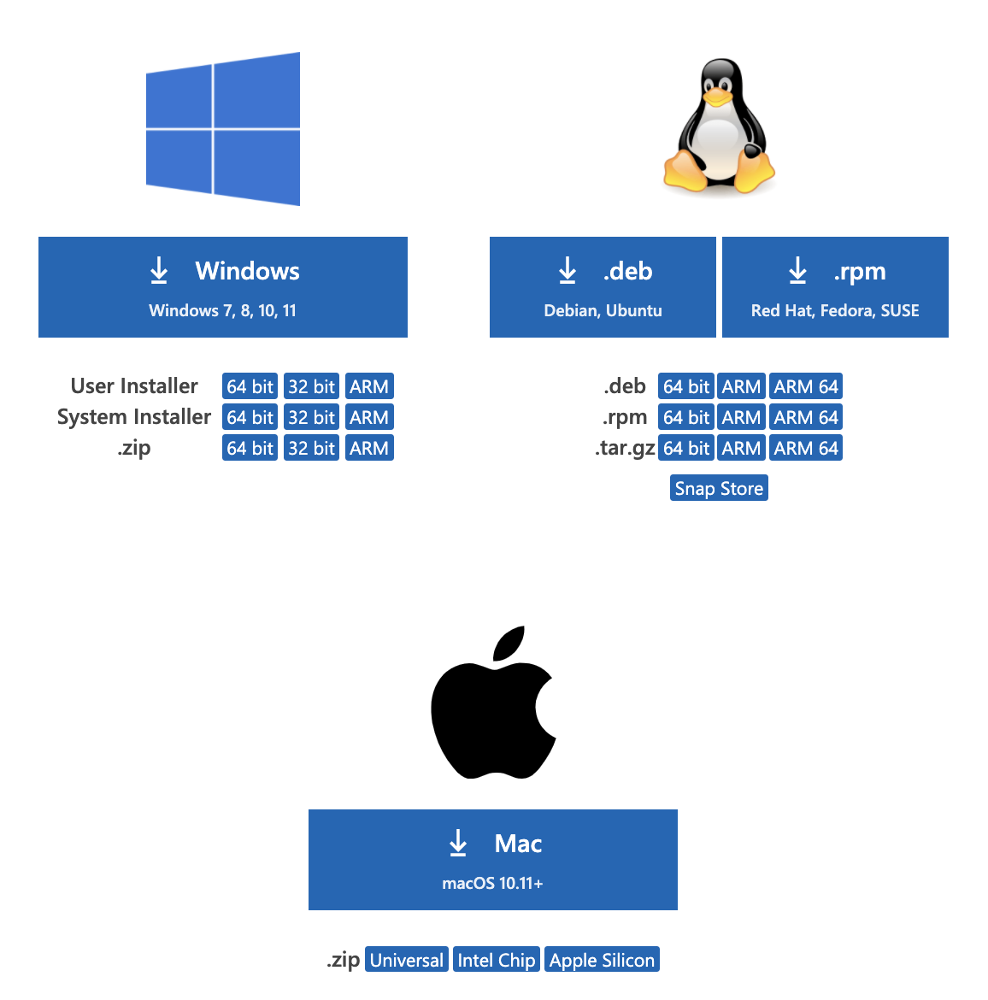

# Lab Report 1
**Jeremy Quinto**

Hello future students (or me)! Welcome to my first lab report. In this report I will give a tutorial on how to login to a course-specific account on the remote server `ieng6`.
---
## Step 1: Installing VS Code
The first step to getting started is installing the wonderful IDE, VSCode.
Head  to this [link](https://code.visualstudio.com/download) in order to download VSCode. Your page should look like this:

Once you have VSCode installed and open, you are ready for the next step.
---
## Step 2: Remotely Connecting
For this class, you will have a course specific account from UCSD. Make sure you know your login and your password for that account so we can login to the server.
First, make sure you install [OpenSHH](https://docs.microsoft.com/en-us/windows-server/administration/openssh/openssh_install_firstuse)
You can look up your course specific account [here](https://sdacs.ucsd.edu/~icc/index.php)

Now we will connect to the remote computer using VSCode's remote opton.

First, open a terminal in VSCode (`Terminal` in the top bar -> `New Terminal`). Then type the following command:
`$ ssh cse15lsp22zz@ieng6.ucsd.edu`
Make sure to replace the portion before "@ieng6" with your course specific username.
If asked if you want to continue connecting, type "yes" and hit enter.

If you've input your username correctly, you will be prompted to input your password (for super secret security reasons, your password won't show up when you type it, this is normal!). If you've entered your password correctly, youy terminal should look a little like this:

Congratulations, you're now connected to a computer in the CSE basement! Your computer is the *client* and the basement computer is the *remote server*. Any commands you type in the client will run on the remote server! Wow!
---
## Step 3: Trying Some Commands
Now we will try out some commands. Try running the commands `cd`, `ls`, `pwd`, `mkdir`, and `cp` a couple times on the terminal connected to `ieng6`. Then try running these same commands in another terminal in VSCode. They should produce different results. 

To log out of the server, use
* Ctrl-D
* Run the command `exit`

To open multiple terminals in VSCode, click the "+" button in the top right of the terminal window. 
---
## Step 4: Moving Files Over SSH With `scp`
Now we will learn how to move files from our computer to the remote server. To do this, we'll use the command `scp`, and we will run it from the client (your computer connected to `ieng6`).

Create a file in VSCode called `WhereAmI.java`. Add the following code into the file:

Run the code using `javac` and `java` (assuming you have java installed).

Then, in the terminal from the directory where you made this file, run this command:
`scp WhereAmI.java cs15lsp22zz@ieng6.ucsd.edu:~/`
Again, make sure you replace the "zz" with your actual username. 

You should be prompted with a password again, go ahead and input it.
Then, you should login to `ieng6` with `ssh` again. Once you're in, run the command `ls` again. You should see the file in your home directory!

Now run it on the `ieng6` computer using `javac` and `java`. Java is installed on the server, so it should be able to run for everyone.

Now take note of what is output when you run `WhereAmI.java` on your computer vs on the remote server. `getProperty` seems to get its properties from the device it's running on.
---
## Step 5: Setting An SSH Key
Inputting your password every time you login can end up taking a long time in the long run, espcially if you're doing this hundreds of times (and the course specific passwords are like 12 characters long!). In this step we'll outline a process that will generate an SSH key, allowing you to login in a lot less time.

The idea behind this is a program called `ssh-keygen`, which creates a pair of files called the *public key* and the *private key*. You will copy the key to a particular location on the server, and the private key in a particular location in the client. Then, the `ssh` command will use this pair of files together in place of your password. Very nice!

Open a terminal on your computer. Type `$ ssh-keygen`
It should ask you for a file in which to save the key. Enter
`/Users/<user-name>/.ssh/id_rsa`
It will then ask you for a passphrase. **Click enter, do not enter a passphrase!**

You will then get a message that looks like

If you're on Windows, follow these [extra steps](https://docs.microsoft.com/en-us/windows-server/administration/openssh/openssh_keymanagement#user-key-generation)

This created two files: the private key (id_rsa) and the public key (id_rsa.pub). Now we will copy the **public** key to the `.ssh` directory of your user account on the server. 

Login to `ieng6` in a terminal. Then run the command `mdkir .ssh`. Logout once you're done.

Now, on the client, type
`scp /Users/<user-name>/.ssh/id_rsa.pub cs15lsp22zz@ieng6.ucsd.edu:~/.ssh/authorized_keys`
Use your username in the path above.

Once you've done this command, you'll be able to login to `ieng6` without a password. Amazing!
---
## Step 6: Optimizing Remote Running
Now we can further optimize remote running. 

You can write a command in quotes at the end of an `ssh` command to run it directly on the server, then exit. Try:
`$ ssh cs15lsp22zz@ieng6.ucsd.edu "ls"`

For example, this is what happens when you put `cat WhereAmI.java` in quotes after the `ssh` command:

You can also use semicolons to run multiple commands on the same line in most terminals. Try:
`$ cp WhereAmI.java OtherMain.java; javac OtherMain.java; java WhereAmI

You can use the up-arrow on your keyboard to recall the last command that was run.
---
## Wrapping Up
This is all for my tutorial on remote connecting. Thank you for reading and I hope this worked for you! **Have a great day!**