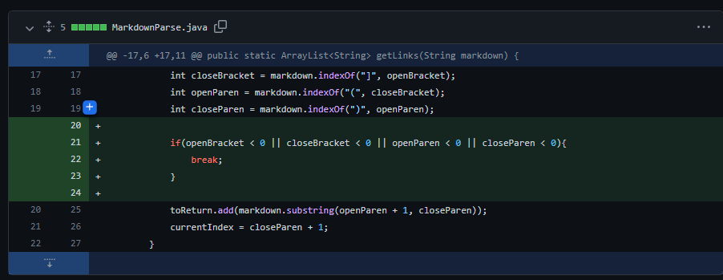
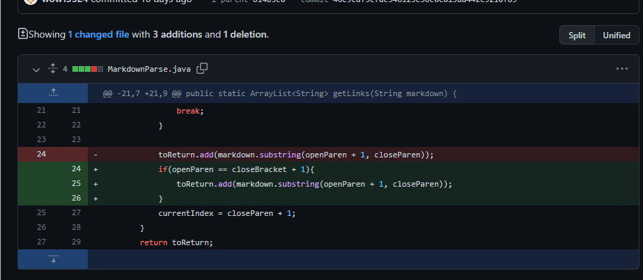
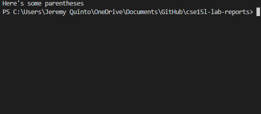
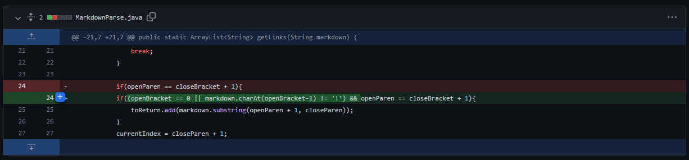
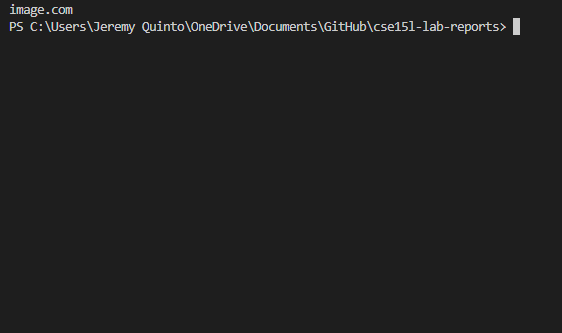

# Lab Report 2
**Jeremy Quinto**

Hello again, future students (or me)! Welcome to my second lab report. In this report I will be going over some examples of bugs, symptoms, and failure-inducing-inputs. We will use examples from our Markdown Parser program. 

## MarkdownParse
The MarkdownParse program reads a markdown file and returns an ArrayList of Strings that contain the URL's that are found in the markdown file. 

The following is the code for the MarkDownParse program:
```
//https://howtodoinjava.com/java/io/java-read-file-to-string-examples/

import java.io.IOException;
import java.nio.file.Files;
import java.nio.file.Path;
import java.util.ArrayList;

public class MarkdownParse {

    public static ArrayList<String> getLinks(String markdown) {
        ArrayList<String> toReturn = new ArrayList<>();
        // find the next [, then find the ], then find the (, then read link upto next )
        int currentIndex = 0;
        while(currentIndex < markdown.length()) {
            int openBracket = markdown.indexOf("[", currentIndex);
            int closeBracket = markdown.indexOf("]", openBracket);
            int openParen = markdown.indexOf("(", closeBracket);
            int closeParen = markdown.indexOf(")", openParen);
            toReturn.add(markdown.substring(openParen + 1, closeParen));
            currentIndex = closeParen + 1;
        }

        return toReturn;
    }


    public static void main(String[] args) throws IOException {
        Path fileName = Path.of(args[0]);
        String content = Files.readString(fileName);
        ArrayList<String> links = getLinks(content);
	    System.out.println(links);
    }
}
```

## Change 1
This is an example of a change we made in the code that helped this code create a little less bugs:



[This is an example of a test file that is a failure-inducing input.](lr2-test-cases/testcase1.md)

In this case, the program does not output anything. 

The symptom of this failure-inducing input is that the while loops runs forever, which means the program never outputs what is desired, since getLinks() never gets to return anything. 

The bug of the code is a logic error. After finding the last closeParen, currentIndex is less than the length of the file so it keeps looping back to the first link. To fix this bug, we added a check that will break the while loop if the indexes found were -1. 

The bug, which was a logic error, caused the symptom, which was an infinite loop. In this case, the failure-inducing input would be any markdown file, as this symptom would occur for any input file. 

## Change 2
This is another example of a change we made in the code that helped this code create a little less bugs:



[This is an example of a test file that is a failure-inducing input](lr2-test-cases/testcase2.md)


In this example, the symptom is the program adding extra things to the list to return. More specifically, failure-inducing inputs for this bug would be markdown files where brackets `[]` are used, and a couple words or lines later, parentheses `()` are used. In this case, nothing should be added to the list, but before our changes, everything in between the parentheses would be added to the list.

The bug is a logic error. Instead of just checking the locations for the brackets and parentheses, the program should also check if openParen comes directly after closeBracket. 

The bug, which was a logic error, caused the symptom, which was undesired additions to the returning list. In this case, the failure-inducing input would be any markdown that uses brackets and parentheses not next to each other. 

## Change 3
This is a final example of a change we made in the code that helped the code create a little less bugs:



[This is an example of a test file that is a failure-inducing input](lr2-test-cases/testcase3.md)


For this program, images should not be added to the list to return. Before our change, however, the program would return them. The symptom of this bug is images appearing in the return list. 

The bug is a logic error. Instead of only checking the brackets and parentheses, the program requires an extra check to make sure `!` doesn't appear directly before the first bracket of a link. 

The bug, which was a logic error, caused the symptom, which was undesired image links being added to the returning list. In this case, a failure-inducing input would be any markdown that has images.

## Conclusion

It is important to always check for symptoms, and use those symptoms to fix bugs in your code. Failure-inducing inputs are important for finding symptoms. 

Thanks for reading!