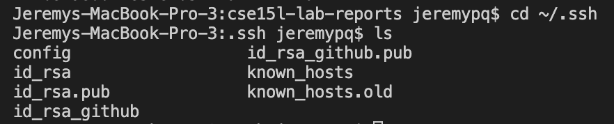

# Lab Report 3
**Jeremy Quinto**

Hello again, future students (or me)! Welcome to my third lab report. In this report, we will be learning how to do a couple of things: 

1. Streamlining `ssh` configuration
2. Setting up GitHub Access from `ieng6`
3. Copying whole directories with `scp -r`

## Streamlining `ssh` Configuration
To log onto the `ieng6` server from your desktop, you would type:
`ssh cs15lsp22zzz@ieng6.ucsd.edu`
This can be a lot to type every single time you're trying to log into the server. Luckily, we're going to streamline this!

To do this, we will add an entry in `~/.ssh/config` that tells SSH what username to use when logging into certain servers. 

In order to do this, on our remote desktop, follow these steps: 
1. Open up a Terminal
2. Create the `~/.ssh` directory if it doesn't exist:
    `mkdir -p ~/.ssh`
3. Go into the directory:
    `cd ~/.ssh`
4. We will now open the file `config` with the default editor:
    `open -t config`
    If it doesn't exist, create it with
    `touch config`
    and then try opening it again.
5. Finally, we will add the following lines to the file (make sure you're writing in Plain Text: **Format -> Make Plain Text**):
    ```
    Host ieng6
        HostName ieng6.ucsd.edu
        User cs15lsp22zzz (use your username)
    ```
*(I demonstrated these steps for Mac, but for other OS just open the `~/.ssh/config` file and follow step 5)*

This is what my terminal looked like when doing the steps above:

And this is what my config file looked like after:


Next, run the command `ssh ieng6`, and if everything works, you should be logged in immediately, with no password! How easy!


If it doesn't work, try adding another line to the config file that explicitly refers to your `id_rsa` file (if you haven't made an `id_rsa` file, I explain how to do it in Lab Report 1):
```
Host ieng6
    HostName ieng6.ucsd.edu
    User cs15lsp22zzz (use your username)
    IdentityFile ~/.ssh/id_rsa
```

And there it is! Logging into the remote server is now a lot simpler! Great!

Now, as an example, I will demonstrate creating a secure copy onto the server with this streamlined approach.

Type `scp <file> ieng6` to copy a file. In this example, I copied `ToCopy.java`.


## Setting Up GitHub Access From `ieng6`
In command-line `git`, we saw in class how to use `clone` and `pull` to get code from GitHub, and even `git status` to check the status. However, when we try and run `commit` and `push`, we get an error!

Support for password authentication was removed, so we must use a personal access token instead, just like SSH keys.

To configure your account on GitHub.com to use your new SSH key, you'll need to add the key to your account. 

THe first step I took is to make a new key using `ssh-keygen`. Doing this will create a new private/public key pair similar to the one used to login to the `ieng6` server. 

1. Open a Terminal and enter `ssh-keygen`
2. For the file name, type `/Users/<user-name>/.ssh/id_rsa_github`

This will create a new key in your `/.ssh` folder. Open up Terminal again, and do the following:

1. Change your directory to `/.ssh`:
    `cd ~/.ssh`
2. Open up the public key you just created:
    `open -t id_rsa_github.pub`
3. Copy the contents.
4. Open GitHub on a browser and go to `Settings -> Access -> SSH Keys`.
5. Click `New SSH KEY`. Input the name of your device, and paste the key you copied.
6. Click `Add SSH Key`.

Now you should be good to use GitHub through your Terminal. Some notes:
- Make sure you have Git downloaded on your Mac (I had to download it)
- Make sure you copy/paste the **public** key to GitHub

For reference, here is what my GitHub's SSH key page looks like: 

This is where my public and private keys are stored on my device:

This is me using Git Commands to commit and push using terminal:

This is a link to the commit shown above:
[](https://github.com/jpquinto/cse15l-lab-reports/commit/7ad95ebf69c1ec56ed15a1d00a02bffc171d29ae)
