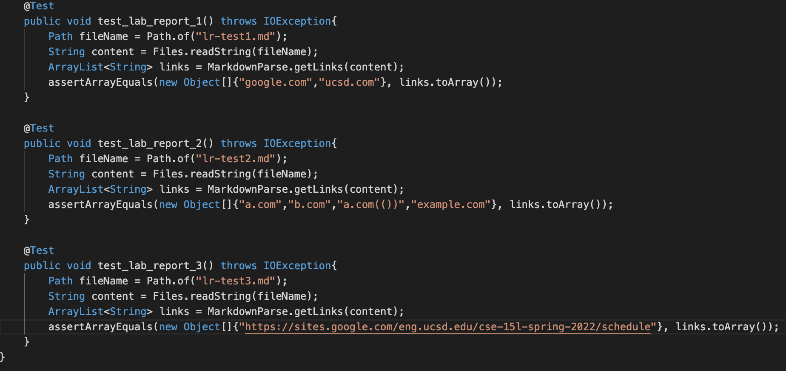
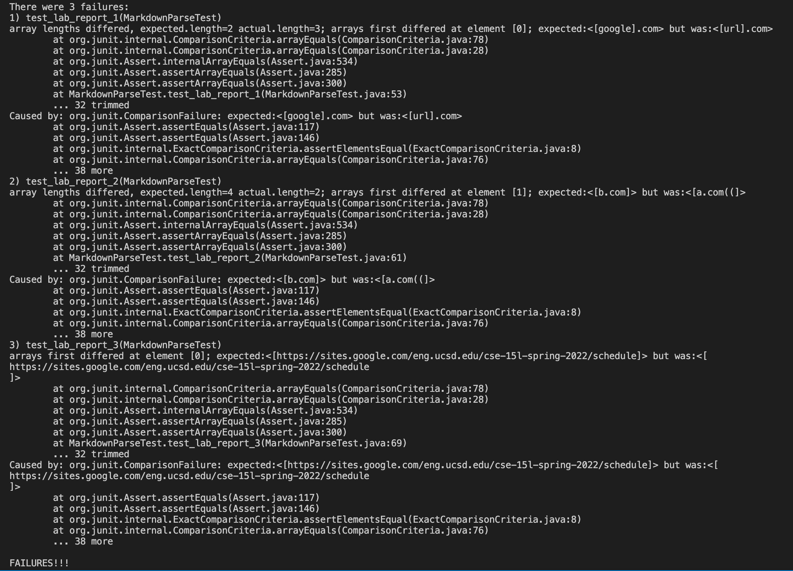
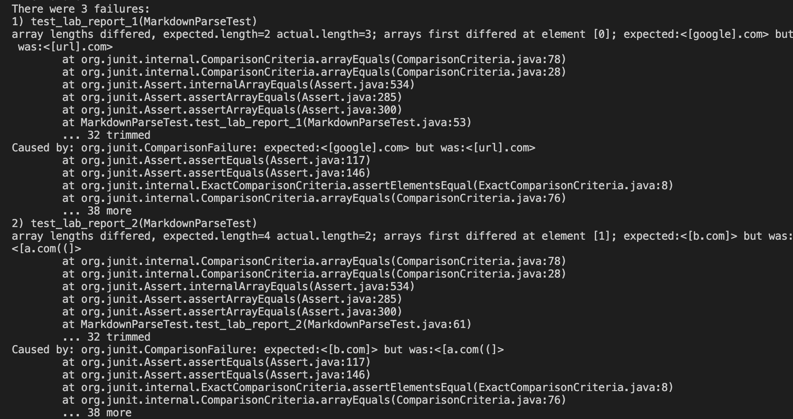
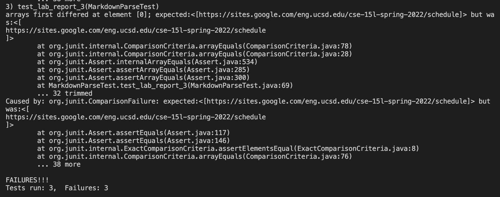

# Lab Report 4
**Jeremy Quinto**

Hello again, future students (or me)! Welcome to my fourth lab report. In this report, we will be testing a couple implmentations of a markdown parser. 

## Implementations
Here are the links to the implementations we will be testing:

[My group's](https://github.com/wow13524/markdown-parser)

[Other](https://github.com/nidhidhamnani/markdown-parser)

## Test Snippets
Before testing, we will take a look at the markdown snippets we will be putting through our markdown implementation. 

### Snippet 1
```
`[a link`](url.com)

[another link](`google.com)`

[`cod[e`](google.com)

[`code]`](ucsd.edu)
```
This is our first snippet. We expect a perfect implementation of markdown parser to produce the list: "google.com" and "ucsd.edu". This is because the backticks should make it so that the first two do not produce a link.

### Snippet 2
```
[a [nested link](a.com)](b.com)

[a nested parenthesized url](a.com(()))

[some escaped \[ brackets \]](example.com)
```
This is our second snippet. We expect a perfect implementation of markdown parser to produce the list: "a.com", "b.com", "a.com(())", and "example.com".

### Snippet 3
```
[this title text is really long and takes up more than 
one line

and has some line breaks](
    https://www.twitter.com
)

[this title text is really long and takes up more than 
one line](
https://sites.google.com/eng.ucsd.edu/cse-15l-spring-2022/schedule
)


[this link doesn't have a closing parenthesis](github.com

And there's still some more text after that.

[this link doesn't have a closing parenthesis for a while](https://cse.ucsd.edu/


)

And then there's more text
```
This is our third snippet. We expect a perfect implementation of markdown parser to produce the list with just "https://sites.google.com/eng.ucsd.edu/cse-15l-spring-2022/schedule".

## Testing The Implementations
Now we will test to see if the implementations correctly parse these markdown snippets.

These are the tests written to test these implementations:


### My Group's Implementation
First, we will test my group's implementation. Unfortunately,all 3 tests failed. 


### Other Implementation
Now we will test the other implementation. Unfortunately for this implementation, all 3 tests failed. 



## How Can We Improve?
Of course, these implementations were a bit underwhelming when it came to these tests. However, there are definitely small adjustments we can make to pass these tests. 

The first problem comes from the backticks. Everything in between backticks should be considered code, so everytime we look for the next bracket or parentheses, we should check if there is a backtick. If there is a backtick, we will not continue the search until another backtick is reached. We could do this by adding a check in between searching for each bracket/parenthesis, and if a backtick is found, maybe call another method that will keep searching for the next backtick. It is doubtful that this would take <10 lines, however. 

For nested brackets, whenever we find a link, we could run the title of the link through the getLinks method and add the result to our list. This would likely take less than <10 lines.

For newlines, we could make sure the implementation keeps checking for brackets/parantheses even after an empty line. This would likely take <10 lines.

So there are definitely ways to improve our code. 

## Conclusion
Some of these tests don't seem like things I would've thought of at first. This is why it is important to always test, and be creative with the tests!