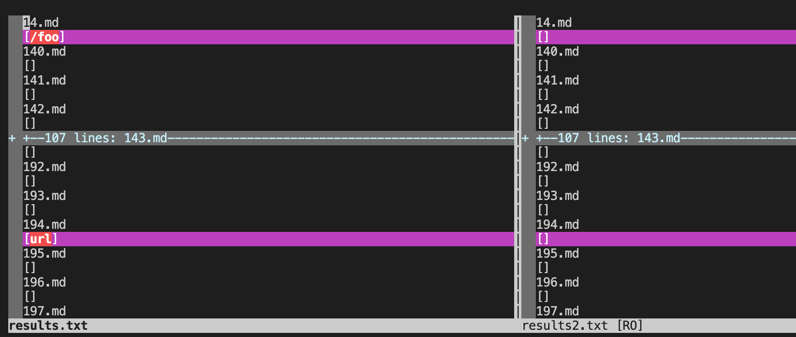
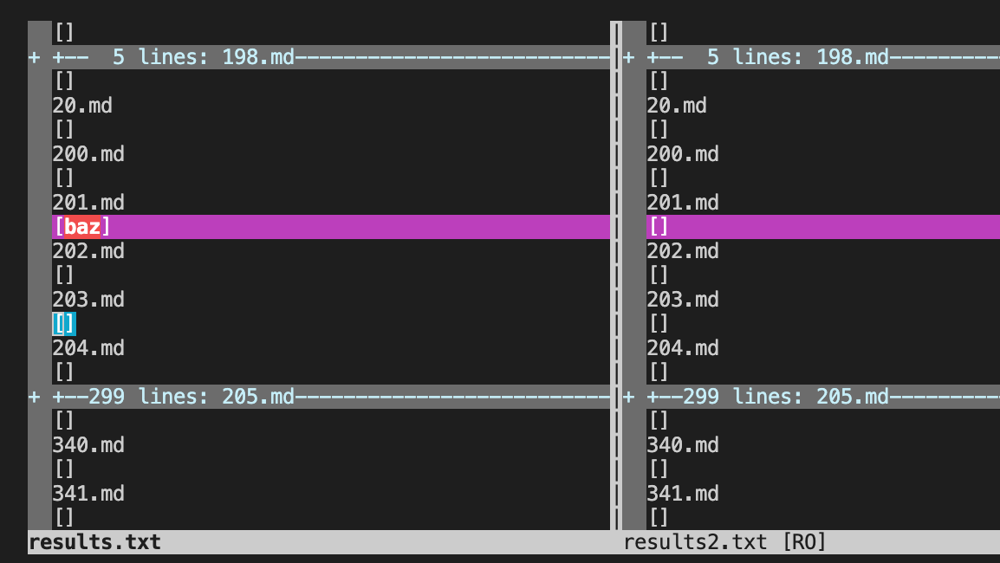
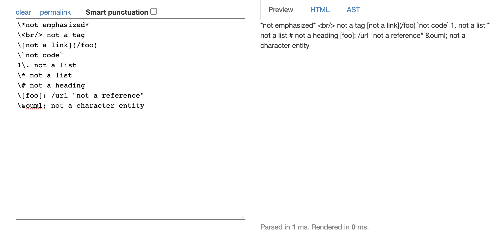
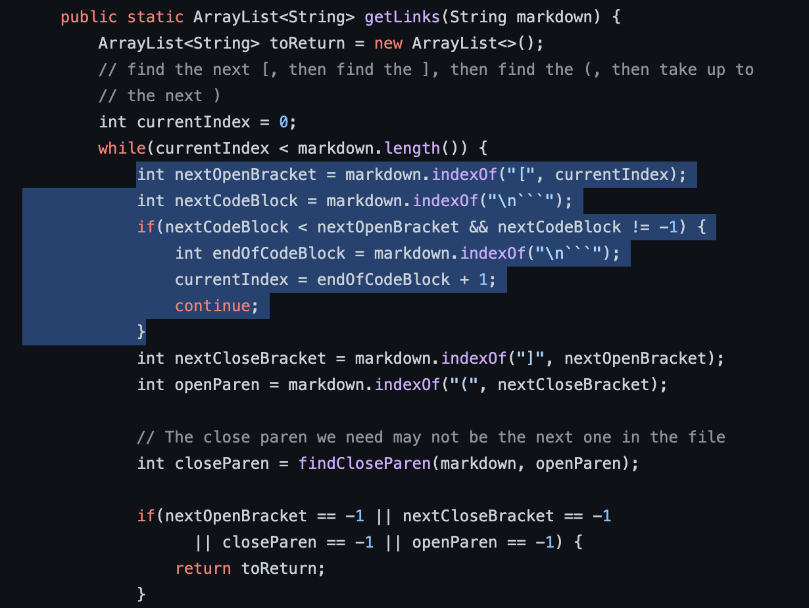
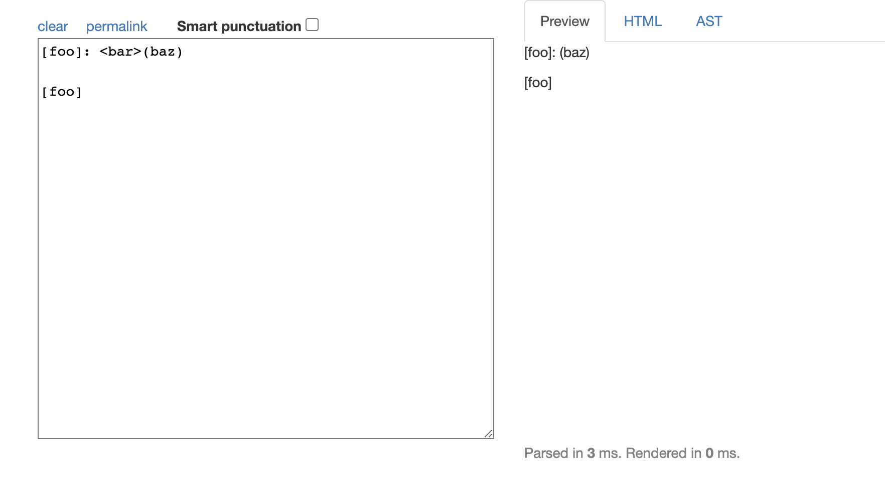
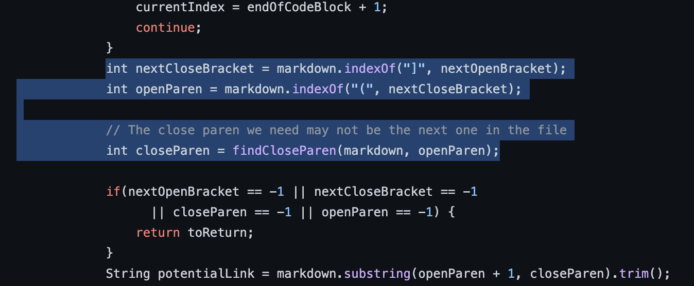

# Lab Report 5
**Jeremy Quinto**

Hello again, future students (or me)! Welcome to my fifth and final lab report. What a quarter it's been! 

In this report, we will be debugging an implementation of MarkdownParser.

## Implementations
These are the links to the implementations of MarkdownParser we will be looking at today:

[My group's](https://github.com/wow13524/markdown-parser)

[Other](https://github.com/nidhidhamnani/markdown-parser)

## Finding the Differences
We were given 500+ test files. Manually finding the differences in hundreds of tests would take quite some time, so I had to take a different approach.

In order to find which tests the implementations differed in, I used `vimdiff`. First, I ran `bash script.sh > results.txt`, which ran a bash for loop, to run the tests and redirect the output in order to save the results to a text file. 

Below are links to the two result files. `result.txt` is from the given implementation, and `result2.txt` is from my group's.

[result.txt](https://jpquinto.github.io/cse15l-lab-reports/result.txt)
[result2.txt](https://jpquinto.github.io/cse15l-lab-reports/result2.txt)

Then, using `vimdiff` on the two files, found differences in test 14 and 201, as shown below. 

It seems that our implementation (the one on the right) did not find links when the given implementation did. Let's take a look at the tests to see what should've been found. 

## Test 14
Below is the contents of Test 14 put through the CommonMark Demo site. 

It looks like this should return no links, which means our implementation worked for this test! 

Unfortunately for the given implementation, it returned "/foo". The problem comes from the part of the markdown file that says "not a link". 

The given implementation doesn't correctly parse markdown files with "\"'s. To fix this, a check for "\"'s would need to be added in order to pass these kinds of tests.

There are many ways to approach fixing this, but a place where this check could be added is shown below. 

## Test 201
Now we will look at what was different between the implementations running test 201. Here is what pasting the contents of the test 201 markdown file yields on CommonMark:

As you can see, no links are generated, so nothing is supposed to be returned. Our implementation got this right, but the given implementation did not, as it returned "baz".

The problem seems to arise from the section that says "<bar>". Putting it through certain websites and markdown previewers, this should indent the line. Eitherway, the link should not be valid, and that is why the given implementation fails. 

Adding a check for this scenario would make the implementation work for this test case. Anywhere here should work, after checking for "[]":

## Conclusion

There it is, my final lab report! Thanks for a great quarter!